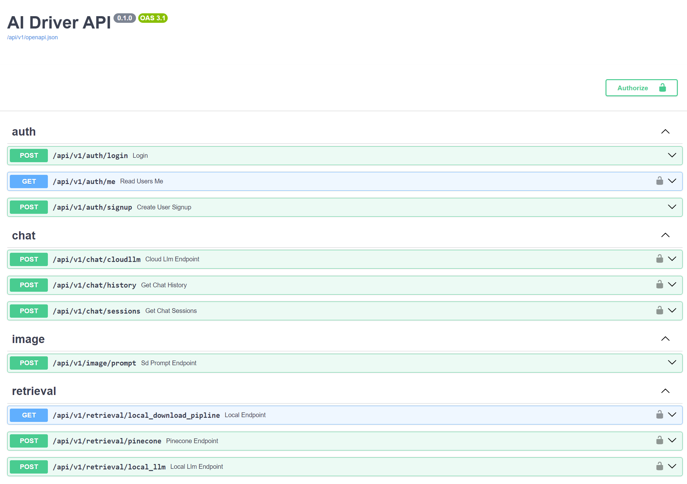

# AIDriver: Your Local Inference Server
[](https://github.com/fearnworks/aidriver/actions/workflows/python-publish.yml)
[](https://github.com/fearnworks/aidriver/actions/workflows/pytest.yml)


====

AI Driver is an inference server for quickly deploying LLM applications that can be consumed over an API. It employs both local and cloud based inference.  

## 🌟 Features
- Cloud Based Inference
- Local Inference (GPU & CPU)
- Prebuilt Inference Flows 
- REST API

## REST API
API Documentation available at the aidriver endpont. By default this is localhost:28001/docs



## Flows 
### Swarm 
Utilize a customizable number of agents to tackle a problem and agregate a solution


### Retrieval Augmented Generation 
Pulls information from a vectorstore for improved domain or context knowledge. Supports pinecone and FAISS currently. 

Added logic to discourage hallucination and to be explicit when it doesn't have information on the query.


## Chat
Supports Local or OpenAI Inference. Currently running quantized GGMLs for local inference.


## 🚀 Getting Started
AI Driver is meant to be run inside of container for easy deployment in any environment. Docker and Docker Compose must be installed in your environment. Cuda drivers are required for GPU support. Drivers should be capable of running cuda 12.x

### Docker
To pull from the latest release image

```bash
docker pull fearnworks/aidriver:main
```

Dockerhub links :
[AI Driver](https://hub.docker.com/repository/docker/fearnworks/aidriver/general)
### Build from Repo
Currently this proces is only tested on Ubuntu 22.04
Clone the repo

```bash
git clone https://github.com/fearnworks/aidriver
cd aidriver
```

Install dependencies for the build chain and python virtual environment

Dependencies : (easy install)
```bash
chmod +x ./scripts/initial_server_setup_with_deps.sh
./scripts/initial_server_setup_with_deps.sh
cp .envtemplate .env
```

Setup nvidia drivers

```bash
chmod +x ./scripts/nvidia_driver_setup.sh
sudo ./scripts/nvidia_driver_setup.sh
```

Reboot your machine to ensure the drivers are loaded

Ai Driver Server run
```bash
sudo docker-compose up --build
```

Download the models and place them in the top level artifacts folder. There is a helper script here :
[download_model](ai_driver/ai_driver/scripts/download_model.py)

We'll be adding more mature support for model downloads in the future

## 💡 Contributing

We welcome contributions to DungeonDriver! Follow the [Contributing Guidelines](./CONTRIBUTING.md) to get started.

## ❓ FAQ

### Common Errors
If you receive a Failed to create llm 'llama' delete your llama model in the artifacts folder and try again. This is an issue with the download from hugging face

To do so run the following command from the root of the project
```bash
rm -rf ./artifacts/* # or the specific model folder
source .server-venv/bin/activate
python ai_driver/ai_driver/scripts/download_model.py
```

## 📬 Contact

Got questions or feedback? Feel free to reach out to us here on github!

## Associated Projects
Dungeondriver shows consumption of the aidriver to provide a game master assistant for tabletop games : 

[DungeonDriver Docker](https://hub.docker.com/repository/docker/fearnworks/dungeondriver/general)
[DungeonDriver Github](https://github.com/fearnworks/dungeondriver)
